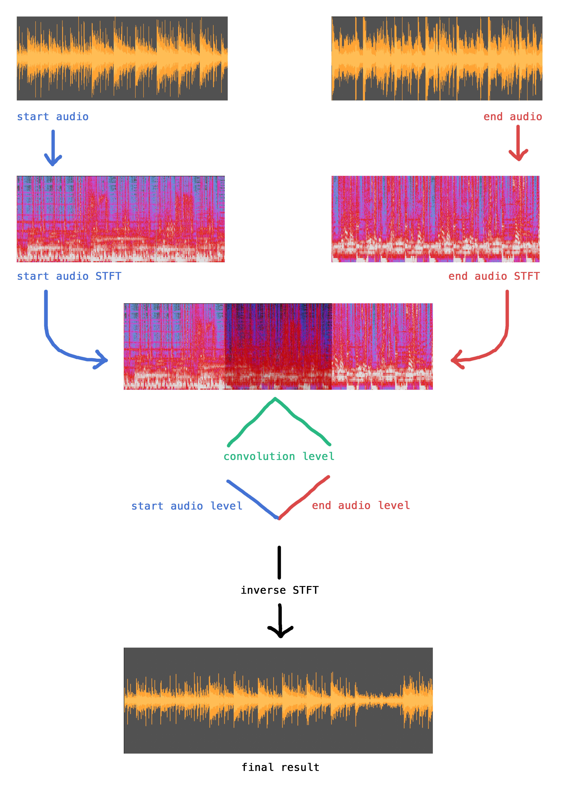

# ConvFade

An experimental command-line audio tool for integrating convolution into a crossfade.

#### Example:

<a href="./example/audio_a.wav">Audio A</a>: J.S. Bach - The Goldberg Variations (Variation 1) - Kimiko Ishizaka's *The Open Goldberg Variations*

<a href="./example/audio_b.wav">Audio B</a>: Joseph Haydn - *The Seasons* - MIT Concert Choir

<a href="./example/result.wav"> ConvFade Result </a> (with arguments `-l 10 -f 150`)

#### Process:

